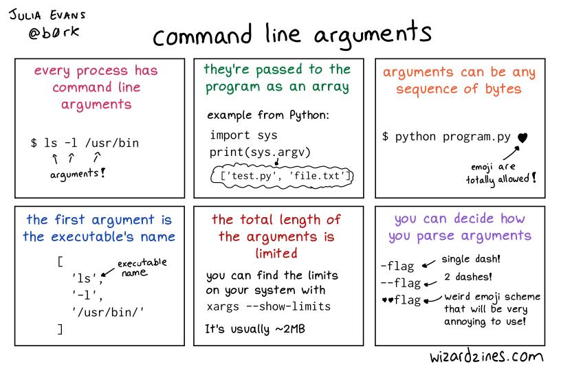

<p align="center">
  
</p>

# argc_argv

> Your program has a voice — `argc` and `argv` are how it listens to the world.

---

## 📝 Description

This project is part of my low-level programming curriculum at Holberton School. It focuses on how C programs receive and process command-line arguments through the `argc` and `argv` parameters of the `main` function. Through a series of progressively challenging programs, I learn to read, validate, and compute with arguments passed at runtime — without touching global variables and while correctly handling edge cases like missing arguments, invalid input, and dynamic renaming of the program itself.

---

## 🎯 Learning Objectives

At the end of this project, I am able to explain how to use arguments passed to a C program via the command line. I know the two prototypes of `main` — `int main(void)` and `int main(int argc, char *argv[])` — and I understand in which situations each one should be used. I am also able to use `__attribute__((unused))` or a cast to `(void)` to properly compile functions that contain unused variables or parameters without triggering warnings.

---

## 🛠️ Technologies Used

All programs in this project are written in **C** and compiled on **Ubuntu 20.04 LTS** using `gcc` with the flags `-Wall -Werror -Wextra -pedantic -std=gnu89`. Code style is enforced by the **Betty linter**. Unlike previous projects, the **standard library is allowed** here, enabling the use of `printf`, `atoi`, and other utilities to process and display argument data.

---

## ⚙️ Requirements

- **OS:** Ubuntu 20.04 LTS
- **Compiler:** `gcc` with options `-Wall -Werror -Wextra -pedantic -std=gnu89`
- **Allowed editors:** `vi`, `vim`, `emacs`
- All files must end with a **new line**
- No errors and no warnings during compilation
- Global variables are **not allowed**
- No more than **5 functions per file**
- The **standard library is allowed**
- All function prototypes and `_putchar` must be declared in `main.h`
- Code must follow the **Betty style**

---

## 🚀 Installation

```bash
git clone https://github.com/GwenP88/holbertonschool-low_level_programming.git
cd holbertonschool-low_level_programming/argc_argv
```

---

## ▶️ Usage / Execution

Compile any `.c` file and run the resulting executable, passing arguments as needed:

```bash
gcc -Wall -pedantic -Werror -Wextra -std=gnu89 0-whatsmyname.c -o mynameis
./mynameis
```

For programs that require arguments:

```bash
gcc -Wall -pedantic -Werror -Wextra -std=gnu89 3-mul.c -o mul
./mul 6 7
```

Replace filenames and arguments as appropriate for each task.

---

## 📊 Project Progress

<p align="center">

</p>

<p align="center">
<sub>Mandatory tasks completion: 100% --- Advanced tasks completion: 0%</sub>
</p>

---

## ✨ Features

### Task 0 - It ain't what they call you, it's what you answer to

- Mandatory
- Write a program that prints its own name followed by a new line; renaming the binary changes what is printed without recompiling
- Must use `argv[0]`; the path before the name must not be removed
- Outputs `./mynameis` when invoked as `./mynameis`, and updates automatically if the binary is renamed

**Files:** `0-whatsmyname.c`

---

### Task 1 - Silence is argument carried out by other means

- Mandatory
- Write a program that prints the number of arguments passed to it, followed by a new line
- Must use `argc`; the program name itself does not count
- Outputs `0` when called with no arguments, `1` for one argument, and so on

**Files:** `1-args.c`

---

### Task 2 - The best argument against democracy is a five-minute conversation with the average voter

- Mandatory
- Write a program that prints all arguments it receives, one per line, including `argv[0]`
- Must iterate over `argv` using `argc`
- Outputs every argument on its own line, starting with the program name

**Files:** `2-args.c`

---

### Task 3 - Neither irony nor sarcasm is argument

- Mandatory
- Write a program that multiplies two numbers passed as arguments and prints the result; prints `Error` and returns `1` if the number of arguments is not exactly two
- Must use `atoi`; result fits in an `int`
- Outputs the integer product of the two arguments, or `Error\n` with exit status `1` on bad input

**Files:** `3-mul.c`

---

### Task 4 - To infinity and beyond

- Mandatory
- Write a program that adds all positive numbers passed as arguments; prints `0` if no arguments; prints `Error` and returns `1` if any argument contains non-digit characters
- Must validate each argument character by character; result fits in an `int`
- Outputs the sum of all valid arguments, `0` for no arguments, or `Error\n` with exit status `1` for invalid input

**Files:** `4-add.c`

---

### Task 5 - Minimal Number of Coins for Change

- Advanced - **This task is still in progress — my future self is on it.**
- Write a program that prints the minimum number of coins needed to make change for a given number of cents using coins of 25, 10, 5, 2, and 1
- Usage: `./change cents`; must use `atoi`; prints `Error` and returns `1` if argument count is not exactly 1; prints `0` for negative input
- Outputs the minimum number of coins as a single integer followed by a new line

**Files:** `100-change.c`

---

## 🔮 What’s Next

I plan to continue working on this project by completing the advanced tasks that are not done yet. This will allow me to deepen my understanding, improve my skills, and push a bit further beyond the basics (because stopping halfway is not really my style).

---

## 🤝 Contributions & Acknowledgements

Thanks to Holberton School for a project that teaches something deceptively simple but genuinely fundamental: how a program talks to its user before a single line of logic runs. Special thanks to `argc` for always being honest about how many arguments actually showed up.

---

## 👤 Author

**Gwenaelle PICHOT**
- Student at Holberton School
- Track: `holbertonschool-low_level_programming`
- Project: `argc_argv`
