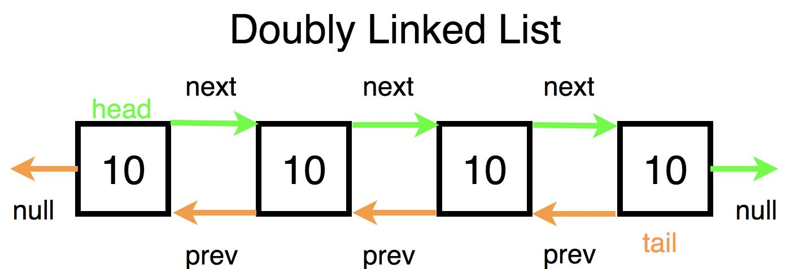

<p align="center">
  
</p>

# doubly_linked_lists

> Singly linked lists only look forward — doubly linked lists have the wisdom to also look back.

---

## 📝 Description

This project is part of my low-level programming curriculum at Holberton School. It focuses on doubly linked lists: a fundamental data structure where each node holds a value and two pointers — one to the next node and one to the previous one. Through a series of progressively complex functions, I build an entire doubly linked list library from scratch: printing, counting, inserting, deleting, and traversing nodes in both directions. The project also includes advanced challenges such as reverse-engineering a crackme password, finding a mathematical palindrome, and writing a keygen — because a data structure project is not complete without a little detective work.

---

## 🎯 Learning Objectives

At the end of this project, I am able to explain what a doubly linked list is and how it differs from a singly linked list. I know how to use doubly linked lists effectively: how to traverse them in both directions, how to insert nodes at specific positions, how to delete nodes cleanly while maintaining the integrity of both `prev` and `next` pointers, and how to free an entire list without memory leaks. I have also developed the habit of finding the right source of information independently when documentation is sparse.

---

## 🛠️ Technologies Used

All programs in this project are written in **C** and compiled on **Ubuntu 20.04 LTS** using `gcc` with the flags `-Wall -Werror -Wextra -pedantic -std=gnu89`. Code style is enforced by the **Betty linter**. The allowed standard library functions are `malloc`, `free`, `printf`, and `exit`. All function prototypes are declared in the header file `lists.h`, which uses include guards. Memory correctness is verified using **Valgrind**.

The data structure used throughout is:

```c
typedef struct dlistint_s
{
    int n;
    struct dlistint_s *prev;
    struct dlistint_s *next;
} dlistint_t;
```

---

## ⚙️ Requirements

- **OS:** Ubuntu 20.04 LTS
- **Compiler:** `gcc` with options `-Wall -Werror -Wextra -pedantic -std=gnu89`
- **Allowed editors:** `vi`, `vim`, `emacs`
- All files must end with a **new line**
- No errors and no warnings during compilation
- Global variables are **not allowed**
- No more than **5 functions per file**
- Only `malloc`, `free`, `printf`, and `exit` are allowed from the standard library
- All function prototypes must be declared in `lists.h`
- All header files must be **include guarded**
- Do not push `main.c` test files
- Code must follow the **Betty style**

---

## 🚀 Installation

```bash
git clone https://github.com/GwenP88/holbertonschool-low_level_programming.git
cd holbertonschool-low_level_programming/doubly_linked_lists
```

---

## ▶️ Usage / Execution

Compile any `.c` file with its test main and the required dependencies:

```bash
gcc -Wall -pedantic -Werror -Wextra -std=gnu89 0-main.c 0-print_dlistint.c -o a
./a
```

For tasks that depend on multiple source files:

```bash
gcc -Wall -pedantic -Werror -Wextra -std=gnu89 7-main.c 2-add_dnodeint.c 3-add_dnodeint_end.c 0-print_dlistint.c 4-free_dlistint.c 7-insert_dnodeint.c -o j
./j
```

Use Valgrind to check for memory leaks:

```bash
valgrind ./e
```

---

## 📊 Project Progress

<p align="center">

</p>

<p align="center">
<sub>Mandatory tasks completion: 100% --- Advanced tasks completion: 0%</sub>
</p>

---

## ✨ Features

### Task 0 - Print list

- Mandatory
- Write a function that prints all elements of a `dlistint_t` list and returns the number of nodes
- Prototype: `size_t print_dlistint(const dlistint_t *h);` — `printf` allowed
- Prints each node's integer value on its own line and returns the total node count

**Files:** `0-print_dlistint.c`

---

### Task 1 - List length

- Mandatory
- Write a function that returns the number of elements in a `dlistint_t` list
- Prototype: `size_t dlistint_len(const dlistint_t *h);` — no standard output required
- Returns the total count of nodes by traversing the list from head to tail

**Files:** `1-dlistint_len.c`

---

### Task 2 - Add node

- Mandatory
- Write a function that adds a new node at the beginning of a `dlistint_t` list; returns the address of the new element, or `NULL` on failure
- Prototype: `dlistint_t *add_dnodeint(dlistint_t **head, const int n);` — `malloc` and `free` allowed
- The new node becomes the new head; its `next` points to the old head and its `prev` is `NULL`

**Files:** `2-add_dnodeint.c`

---

### Task 3 - Add node at the end

- Mandatory
- Write a function that adds a new node at the end of a `dlistint_t` list; returns the address of the new element, or `NULL` on failure
- Prototype: `dlistint_t *add_dnodeint_end(dlistint_t **head, const int n);` — `malloc` and `free` allowed
- The new node becomes the new tail; its `prev` points to the old tail and its `next` is `NULL`

**Files:** `3-add_dnodeint_end.c`

---

### Task 4 - Free list

- Mandatory
- Write a function that frees all nodes of a `dlistint_t` list
- Prototype: `void free_dlistint(dlistint_t *head);` — `free` allowed
- Traverses the list and frees each node; Valgrind reports zero leaks after execution

**Files:** `4-free_dlistint.c`

---

### Task 5 - Get node at index

- Mandatory
- Write a function that returns the nth node of a `dlistint_t` list (index starts at `0`); returns `NULL` if the node does not exist
- Prototype: `dlistint_t *get_dnodeint_at_index(dlistint_t *head, unsigned int index);` — no standard library required
- Returns a pointer to the node at the given index, or `NULL` if out of bounds

**Files:** `5-get_dnodeint.c`

---

### Task 6 - Sum list

- Mandatory
- Write a function that returns the sum of all `n` values in a `dlistint_t` list; returns `0` if the list is empty
- Prototype: `int sum_dlistint(dlistint_t *head);` — no standard library required
- Traverses the entire list and accumulates the integer sum of all node values

**Files:** `6-sum_dlistint.c`

---

### Task 7 - Insert at index

- Mandatory
- Write a function that inserts a new node at a given index in a `dlistint_t` list; returns the address of the new node, or `NULL` if it failed or if the index is unreachable
- Prototype: `dlistint_t *insert_dnodeint_at_index(dlistint_t **h, unsigned int idx, int n);` — compiled with `2-add_dnodeint.c` and `3-add_dnodeint_end.c`
- Correctly updates both `prev` and `next` pointers of the surrounding nodes when inserting

**Files:** `7-insert_dnodeint.c`, `2-add_dnodeint.c`, `3-add_dnodeint_end.c`

---

### Task 8 - Delete at index

- Mandatory
- Write a function that deletes the node at a given index from a `dlistint_t` list; returns `1` on success and `-1` on failure
- Prototype: `int delete_dnodeint_at_index(dlistint_t **head, unsigned int index);` — `free` allowed
- Correctly re-links surrounding nodes and handles head, tail, and out-of-bounds cases

**Files:** `8-delete_dnodeint.c`

---

### Task 9 - Crackme4

- Advanced - **This task is still in progress — my future self is on it.**
- Find the password for the `crackme4` executable; the program prints "OK" when the correct password is entered
- May use `gdb`, `objdump`, `ltrace`, or any reverse-engineering tool; no extra spaces or newlines in the file
- The file contains the exact password string that makes `crackme4` print "OK"

**Files:** `100-password`

---

### Task 10 - Palindromes

- Advanced - **This task is still in progress — my future self is on it.**
- Find the largest palindrome made from the product of two 3-digit numbers and save the result to a file
- No specific constraint on method; result must be exact with no trailing newline or space
- The file contains the single integer result

**Files:** `102-result`

---

### Task 11 - crackme5

- Advanced - **This task is still in progress — my future self is on it.**
- Write a keygen for `crackme5`; usage: `./keygen5 username`; the keygen must print a valid key for any given username; the crackme segfaults with a wrong key
- Compiled with `gcc -Wall -pedantic -Werror -Wextra -std=gnu89`
- Running `./crackme5 username $(./keygen5 username)` outputs `Congrats!`

**Files:** `103-keygen.c`

---

## 🔮 What’s Next

I plan to continue working on this project by completing the advanced tasks that are not done yet. This will allow me to deepen my understanding, improve my skills, and push a bit further beyond the basics (because stopping halfway is not really my style).

---

## 🤝 Contributions & Acknowledgements

Thanks to Holberton School for a project that makes you appreciate just how much work goes into a bidirectional list — and how satisfying it is when both `prev` and `next` point exactly where they should. Special thanks to Valgrind, the strictest memory auditor I have ever worked with, and the most rewarding one to satisfy.

---

## 👤 Author

**Gwenaelle PICHOT**
- Student at Holberton School
- Track: `holbertonschool-low_level_programming`
- Project: `doubly_linked_lists`
