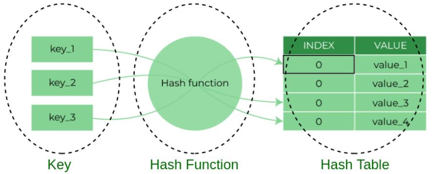

<p align="center">
  
</p>

# hash_tables

> O(1) lookup time — because life is too short to search linearly through everything.

---

## 📝 Description

This project is part of my low-level programming curriculum at Holberton School. It introduces hash tables: one of the most practically important data structures in computer science. I implement a complete hash table library from scratch in C, including the djb2 hashing algorithm, index computation, insertion with collision handling via chaining, lookup, printing, and deletion. The advanced task goes further by implementing a PHP-style sorted hash table that maintains insertion order through a secondary doubly linked list sorted by key. By the end, I have a much better understanding of how Python dictionaries work under the hood — and a healthy respect for the elegance of a good hash function.

---

## 🎯 Learning Objectives

At the end of this project, I am able to explain what a hash function is and what makes a good one — uniform distribution, determinism, and speed. I understand how hash tables work: how keys are mapped to indices, how values are stored and retrieved, and how collisions are handled using chaining (linked lists at each bucket). I can describe the advantages of hash tables — constant average-time lookup and insertion — as well as their drawbacks, such as worst-case performance under heavy collisions and memory overhead. I also know the most common use cases for hash tables, including dictionaries, caches, and set implementations.

---

## 🛠️ Technologies Used

All programs in this project are written in **C** and compiled on **Ubuntu 20.04 LTS** using `gcc` with the flags `-Wall -Werror -Wextra -pedantic -std=gnu89`. Code style is enforced by the **Betty linter**. The full C standard library is allowed for this project. All function prototypes and data structure definitions are declared in the header file `hash_tables.h`, which uses include guards. Memory correctness is verified using **Valgrind**.

The two data structures used are:

```c
typedef struct hash_node_s
{
    char *key;
    char *value;
    struct hash_node_s *next;
} hash_node_t;

typedef struct hash_table_s
{
    unsigned long int size;
    hash_node_t **array;
} hash_table_t;
```

The advanced task additionally uses `shash_node_t` and `shash_table_t` with sorted linked list pointers (`sprev`, `snext`, `shead`, `stail`).

---

## ⚙️ Requirements

- **OS:** Ubuntu 20.04 LTS
- **Compiler:** `gcc` with options `-Wall -Werror -Wextra -pedantic -std=gnu89`
- **Allowed editors:** `vi`, `vim`, `emacs`
- All files must end with a **new line**
- No errors and no warnings during compilation
- Global variables are **not allowed**
- No more than **5 functions per file** (except in the advanced sorted hash table task)
- The **full C standard library is allowed**
- All function prototypes must be declared in `hash_tables.h`
- All header files must be **include guarded**
- Do not push `main.c` test files
- Code must follow the **Betty style**

---

## 🚀 Installation

```bash
git clone https://github.com/GwenP88/holbertonschool-low_level_programming.git
cd holbertonschool-low_level_programming/hash_tables
```

---

## ▶️ Usage / Execution

Compile the required source files together and run:

```bash
gcc -Wall -pedantic -Werror -Wextra -std=gnu89 4-main.c 0-hash_table_create.c 1-djb2.c 2-key_index.c 3-hash_table_set.c 4-hash_table_get.c -o e
./e
```

For the advanced sorted hash table:

```bash
gcc -Wall -pedantic -Werror -Wextra -std=gnu89 100-main.c 100-sorted_hash_table.c 1-djb2.c 2-key_index.c -o sht
./sht
```

Use Valgrind to verify memory usage:

```bash
valgrind ./g
```

---

## 📊 Project Progress

<p align="center">

</p>

<p align="center">
<sub>Mandatory tasks completion: 100% --- Advanced tasks completion: 0%</sub>
</p>

---

## ✨ Features

### Task 0 - >>> ht = {}

- Mandatory
- Write a function that creates a hash table of a given size; returns a pointer to the new hash table, or `NULL` on failure
- Prototype: `hash_table_t *hash_table_create(unsigned long int size);` — standard library allowed
- Allocates the `hash_table_t` struct and its internal array, initializing all buckets to `NULL`

**Files:** `0-hash_table_create.c`

---

### Task 1 - djb2

- Mandatory
- Implement the djb2 hash function that maps a string to an `unsigned long int`
- Prototype: `unsigned long int hash_djb2(const unsigned char *str);` — standard library allowed
- Correctly hashes strings using the formula `hash = hash * 33 + c` initialized at `5381`

**Files:** `1-djb2.c`

---

### Task 2 - key -> index

- Mandatory
- Write a function that returns the index in the hash table array where a key/value pair should be stored; uses `hash_djb2` internally
- Prototype: `unsigned long int key_index(const unsigned char *key, unsigned long int size);` — standard library allowed
- Returns `hash_djb2(key) % size`

**Files:** `2-key_index.c`

---

### Task 3 - >>> ht['betty'] = 'cool'

- Mandatory
- Write a function that adds or updates a key/value pair in the hash table; the value is duplicated; in case of collision, the new node is prepended to the bucket's list; `key` cannot be empty; returns `1` on success, `0` on failure
- Prototype: `int hash_table_set(hash_table_t *ht, const char *key, const char *value);` — standard library allowed
- Handles collisions via chaining; if the key already exists, updates the value in place

**Files:** `3-hash_table_set.c`

---

### Task 4 - >>> ht['betty']

- Advanced - **This task is still in progress — my future self is on it.**
- Write a function that retrieves the value associated with a key; returns `NULL` if the key is not found
- Prototype: `char *hash_table_get(const hash_table_t *ht, const char *key);` — standard library allowed
- Traverses the linked list at the computed index to find and return the matching value

**Files:** `4-hash_table_get.c`

---

### Task 5 - >>> print(ht)

- Advanced - **This task is still in progress — my future self is on it.**
- Write a function that prints all key/value pairs in the hash table in the order they appear in the array (then within each bucket's list); does nothing if `ht` is `NULL`
- Prototype: `void hash_table_print(const hash_table_t *ht);` — standard library allowed
- Outputs in the format `{'key': 'value', ...}`, matching the Python dictionary print style

**Files:** `5-hash_table_print.c`

---

### Task 6 - >>> del ht

- Advanced - **This task is still in progress — my future self is on it.**
- Write a function that deletes a hash table and frees all associated memory, including duplicated keys and values
- Prototype: `void hash_table_delete(hash_table_t *ht);` — standard library allowed
- Traverses every bucket and every node in each chain, freeing all strings and structs; Valgrind reports zero leaks

**Files:** `6-hash_table_delete.c`

---

### Task 7 - $ht['Betty'] = 'Cool'

- Advanced - **This task is still in progress — my future self is on it.**
- Implement a PHP-style sorted hash table where key/value pairs are stored in both the hash array and a secondary sorted doubly linked list (sorted by key in ASCII order); implement `shash_table_create`, `shash_table_set`, `shash_table_get`, `shash_table_print`, `shash_table_print_rev`, and `shash_table_delete`
- More than 5 functions are allowed in this file; uses the `shash_table_t` and `shash_node_t` structures with `sprev`/`snext` pointers
- `shash_table_print` traverses the sorted list from head to tail; `shash_table_print_rev` traverses it from tail to head; insertion correctly places each new node in the sorted position

**Files:** `100-sorted_hash_table.c`

---

## 🔮 What’s Next

I plan to continue working on this project by completing the advanced tasks that are not done yet. This will allow me to deepen my understanding, improve my skills, and push a bit further beyond the basics (because stopping halfway is not really my style).

---

## 🤝 Contributions & Acknowledgements

Thanks to Holberton School for a project that connects the dots between abstract data structures and real-world implementations. Understanding that Python dictionaries are hash tables at their core makes every `d['key']` feel a little more meaningful. Thanks also to the djb2 algorithm — a deceptively simple function that does a surprisingly good job.

---

## 👤 Author

**Gwenaelle PICHOT**
- Student at Holberton School
- Track: `holbertonschool-low_level_programming`
- Project: `hash_tables`
