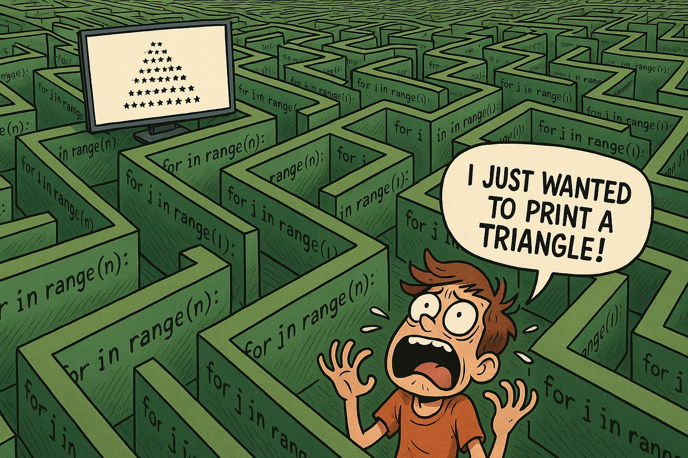

<p align="center">
  
</p>

# more_functions_nested_loops

> Because once wasn't enough — more loops, more functions, more fun.

---

## 📝 Description

This project is the natural continuation of my journey into C functions and nested loops. Building on what I learned previously, I tackled more complex challenges: drawing shapes in the terminal, implementing classic programming problems like FizzBuzz, and even going advanced with prime factorization and a custom integer printer. Each task pushed me to think more carefully about logic, output formatting, and writing clean, reusable C code.

---

## 🎯 Learning Objectives

By completing this project, I am able to explain what nested loops are and demonstrate how to use them in non-trivial contexts such as drawing shapes and printing tables. I understand how to write, declare, and define functions in C, and I know the difference between a declaration and a definition. I can describe what a prototype is and how it is used within a header file. I have a clear understanding of variable scope and how it affects function behavior. I know the purpose of the `gcc` flags `-Wall -Werror -pedantic -Wextra -std=gnu89`, and I can use header files correctly with `#include` to share prototypes across multiple source files.

---

## 🛠️ Technologies Used

This project is written entirely in **C** and compiled using **GCC** on **Ubuntu 20.04 LTS**. The code follows the **Betty style** (enforced via `betty-style.pl` and `betty-doc.pl`) and uses the flags `-Wall -Werror -Wextra -pedantic -std=gnu89`. The standard library is forbidden in most tasks, with `_putchar` being the main output tool. Exceptions are clearly noted per task.

---

## ⚙️ Requirements

- OS: Ubuntu 20.04 LTS
- Compiler: `gcc` with flags `-Wall -Werror -Wextra -pedantic -std=gnu89`
- All files must end with a new line
- Code must follow the **Betty** style
- No global variables allowed
- No more than 5 functions per file
- Standard library functions (`printf`, `puts`, etc.) are **forbidden** unless explicitly stated
- `_putchar` is allowed
- All function prototypes (including `_putchar`) must be in `main.h`
- `main.c` test files are not pushed to the repo

---

## 🚀 Installation

```bash
git clone https://github.com/GwenP88/holbertonschool-low_level_programming.git
cd holbertonschool-low_level_programming/more_functions_nested_loops
```

---

## ▶️ Usage / Execution

Each task can be compiled and run using `gcc`. Example for task 0:

```bash
gcc -Wall -pedantic -Werror -Wextra -std=gnu89 0-main.c 0-isupper.c -o 0-isuper
./0-isuper
```

Refer to each task's compilation command for the correct file names and flags.

---

## 📊 Project Progress

<p align="center">

</p>

<p align="center">
<sub>Mandatory tasks completion: 100% --- Advanced tasks completion: 100%</sub>
</p>

---

## ✨ Features

### Task 0 - isupper

- Mandatory
- Write a function that checks for an uppercase character
- Prototype: `int _isupper(int c);` — returns `1` if uppercase, `0` otherwise
- Returns the correct integer value based on whether the character is uppercase

**Files:** `0-isupper.c`

---

### Task 1 - isdigit

- Mandatory
- Write a function that checks for a digit (0 through 9)
- Prototype: `int _isdigit(int c);` — returns `1` if digit, `0` otherwise
- Returns the correct integer value based on whether the character is a digit

**Files:** `1-isdigit.c`

---

### Task 2 - Collaboration is multiplication

- Mandatory
- Write a function that multiplies two integers
- Prototype: `int mul(int a, int b);`
- Returns the product of the two integers

**Files:** `2-mul.c`

---

### Task 3 - The numbers speak for themselves

- Mandatory
- Write a function that prints the numbers from 0 to 9 followed by a new line
- Prototype: `void print_numbers(void);` — only `_putchar` may be used, at most twice
- Prints `0123456789` followed by a newline

**Files:** `3-print_numbers.c`

---

### Task 4 - I believe in numbers and signs

- Mandatory
- Write a function that prints numbers from 0 to 9 excluding 2 and 4, followed by a new line
- Prototype: `void print_most_numbers(void);` — only `_putchar` may be used, at most twice
- Prints `01356789` followed by a newline

**Files:** `4-print_most_numbers.c`

---

### Task 5 - Numbers constitute the only universal language

- Mandatory
- Write a function that prints 10 times the numbers from 0 to 14 followed by a new line
- Prototype: `void more_numbers(void);` — only `_putchar` may be used, at most three times
- Prints the sequence `01234567891011121314` ten times, each on its own line

**Files:** `5-more_numbers.c`

---

### Task 6 - The shortest distance between two points is a straight line

- Mandatory
- Write a function that draws a straight line of `_` characters in the terminal
- Prototype: `void print_line(int n);` — prints only `\n` if `n <= 0`
- Prints `n` underscores followed by a newline; prints only a newline if `n <= 0`

**Files:** `6-print_line.c`

---

### Task 7 - I feel like I am diagonally parked in a parallel universe

- Mandatory
- Write a function that draws a diagonal line of `\` characters in the terminal
- Prototype: `void print_diagonal(int n);` — prints only `\n` if `n <= 0`
- Prints a diagonal with each `\` offset by one space from the previous; prints only a newline if `n <= 0`

**Files:** `7-print_diagonal.c`

---

### Task 8 - You are so much sunshine in every square inch

- Mandatory
- Write a function that prints a square of `#` characters followed by a new line
- Prototype: `void print_square(int size);` — prints only `\n` if `size <= 0`
- Prints a `size × size` square using `#` characters

**Files:** `8-print_square.c`

---

### Task 9 - Fizz-Buzz

- Mandatory
- Write a program that prints numbers from 1 to 100, replacing multiples of 3 with `Fizz`, multiples of 5 with `Buzz`, and multiples of both with `FizzBuzz`
- Numbers/words separated by a space — standard library allowed
- Prints the correct FizzBuzz sequence from 1 to 100 on a single line

**Files:** `9-fizz_buzz.c`

---

### Task 10 - Triangles

- Mandatory
- Write a function that prints a right-aligned triangle of `#` characters followed by a new line
- Prototype: `void print_triangle(int size);` — prints only `\n` if `size <= 0`
- Prints a triangle of height `size` with proper right-alignment using spaces

**Files:** `10-print_triangle.c`

---

### Task 11 - The problem of distinguishing prime numbers from composite numbers and of resolving the latter into their prime factors is known to be one of the most important and useful in arithmetic

- Advanced
- Write a program that finds and prints the largest prime factor of `612852475143` followed by a new line
- Compiled with `-lm` — standard library allowed
- Prints the correct largest prime factor of the given number

**Files:** `100-prime_factor.c`

---

### Task 12 - Numbers have life; they're not just symbols on paper

- Advanced
- Write a function that prints an integer using only `_putchar`
- Prototype: `void print_number(int n);` — no `long`, no arrays, no pointers, no hard-coded special values
- Correctly prints any integer, including negative values, using only `_putchar`

**Files:** `101-print_number.c`

---

## 🤝 Contributions & Acknowledgements

Thanks to Holberton School for turning simple loops into an existential experience. And to everyone who told me FizzBuzz was "too easy" — you've clearly never tried to do it without `printf`.

---

## 👤 Author

**Gwenaelle PICHOT**
- Student at Holberton School
- Track: holbertonschool-low_level_programming
- Project: more_functions_nested_loops
