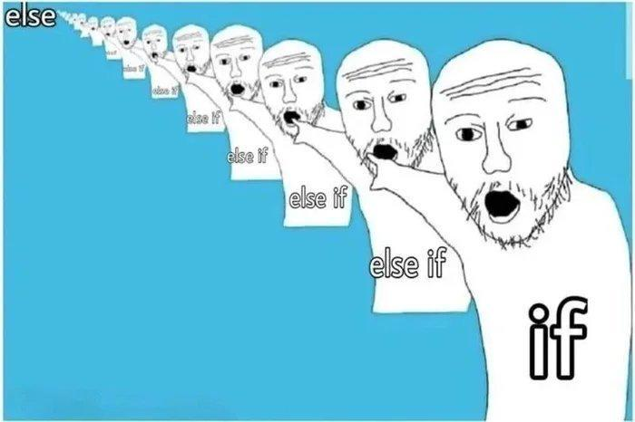

<p align="center">
  
</p>

# variables_if_else_while

> `if` logic is the backbone of programming — `while` I still have things to learn, I'll keep looping through it.

---

## 📝 Description

This project is the next step in my low-level programming journey at Holberton School. I dive into the fundamentals of C: variables, conditional statements, and loops. Through a series of progressively challenging programs, I practice declaring and using variables of types `char`, `int`, and `unsigned int`, print their values with `printf`, and control program flow with `if`, `if...else`, and `while`. I also explore the ASCII character set, understand boolean logic in C, and push my skills with combination-generation challenges that demand both precision and creativity — all within strict `putchar`-only constraints.

---

## 🎯 Learning Objectives

At the end of this project, I am able to explain what the arithmetic operators are and how to use them, as well as logical and relational operators and what values are considered `TRUE` or `FALSE` in C. I understand how to use the `if` and `if...else` statements to control program flow, and I know how to write comments in C. I can declare variables of types `char`, `int`, and `unsigned int`, assign values to them, and print those values correctly with `printf`. I know how to use the `while` loop and how to incorporate variables within it. I understand the ASCII character set and can navigate it programmatically. Finally, I understand the purpose of the `gcc` flags `-m32` and `-m64` and how they affect the size of data types at compilation time.

---

## 🛠️ Technologies Used

All programs in this project are written in **C** and compiled on **Ubuntu 20.04 LTS** using `gcc` with the flags `-Wall -Werror -Wextra -pedantic -std=gnu89`. Code style is enforced by the **Betty linter**. No external libraries are used beyond the C standard library, and many tasks are intentionally restricted to `putchar` only — no `printf`, no `puts`, just raw character output and a healthy dose of ASCII arithmetic.

---

## ⚙️ Requirements

- **OS:** Ubuntu 20.04 LTS
- **Compiler:** `gcc` with options `-Wall -Werror -Wextra -pedantic -std=gnu89`
- **Allowed editors:** `vi`, `vim`, `emacs`
- All files must end with a **new line**
- No errors and no warnings during compilation
- Use of `system` is **not allowed**
- Code must follow the **Betty style** (checked with `betty-style.pl` and `betty-doc.pl`)
- A `README.md` at the root of the project folder is mandatory

---

## 🚀 Installation

```bash
git clone https://github.com/GwenP88/holbertonschool-low_level_programming.git
cd holbertonschool-low_level_programming/variables_if_else_while
```

---

## ▶️ Usage / Execution

Compile any C file and run the resulting executable:

```bash
gcc -Wall -pedantic -Werror -Wextra -std=gnu89 0-positive_or_negative.c -o 0-positive_or_negative
./0-positive_or_negative
```

Replace the filename and output name as needed for each task.

---

## 📊 Project Progress

<p align="center">

</p>

<p align="center">
<sub>Mandatory tasks completion: 100% --- Advanced tasks completion: 100%</sub>
</p>

---

## ✨ Features

### Task 0 - Positive anything is better than negative nothing

- Mandatory
- Complete a given source code to print whether the randomly assigned variable `n` is positive, zero, or negative
- Must not modify the `rand`/`srand` section; must use `if`, `else if`, `else`
- Outputs `<n> is positive`, `<n> is zero`, or `<n> is negative` followed by a new line

**Files:** `0-positive_or_negative.c`

---

### Task 1 - The last digit

- Mandatory
- Complete a given source code to print the last digit of the randomly assigned variable `n` and classify it
- Must use modulo arithmetic; must not modify the `rand`/`srand` section
- Outputs `Last digit of <n> is <last_digit> and is greater than 5`, `and is 0`, or `and is less than 6 and not 0`

**Files:** `1-last_digit.c`

---

### Task 2 - I sometimes suffer from insomnia. And when I can't fall asleep, I play what I call the alphabet game

- Mandatory
- Print the alphabet in lowercase followed by a new line
- Only `putchar` is allowed; all code in `main`; `putchar` used at most twice
- Outputs `abcdefghijklmnopqrstuvwxyz` followed by a new line

**Files:** `2-print_alphabet.c`

---

### Task 3 - alphABET

- Mandatory
- Print the alphabet in lowercase then in uppercase, followed by a new line
- Only `putchar` is allowed; all code in `main`; `putchar` used at most three times
- Outputs `abcdefghijklmnopqrstuvwxyzABCDEFGHIJKLMNOPQRSTUVWXYZ` followed by a new line

**Files:** `3-print_alphabets.c`

---

### Task 4 - When I was having that alphabet soup, I never thought that it would pay off

- Mandatory
- Print the lowercase alphabet excluding the letters `q` and `e`, followed by a new line
- Only `putchar` is allowed; all code in `main`; `putchar` used at most twice
- Outputs all lowercase letters except `q` and `e`, followed by a new line

**Files:** `4-print_alphabt.c`

---

### Task 5 - Numbers

- Mandatory
- Print all single-digit numbers of base 10 starting from `0`, followed by a new line
- All code must be in `main`
- Outputs `0123456789` followed by a new line

**Files:** `5-print_numbers.c`

---

### Task 6 - Numberz

- Mandatory
- Print all single-digit numbers of base 10 starting from `0`, followed by a new line
- No `char` variables allowed; only `putchar` (used at most twice); all code in `main`
- Outputs `0123456789` followed by a new line, using integer arithmetic instead of char variables

**Files:** `6-print_numberz.c`

---

### Task 7 - Smile in the mirror

- Mandatory
- Print the lowercase alphabet in reverse, followed by a new line
- Only `putchar` is allowed; all code in `main`; `putchar` used at most twice
- Outputs `zyxwvutsrqponmlkjihgfedcba` followed by a new line

**Files:** `7-print_tebahpla.c`

---

### Task 8 - Hexadecimal

- Mandatory
- Print all characters of base 16 in lowercase (`0`–`9` then `a`–`f`), followed by a new line
- Only `putchar` is allowed; all code in `main`; `putchar` used at most three times
- Outputs `0123456789abcdef` followed by a new line

**Files:** `8-print_base16.c`

---

### Task 9 - Patience, persistence and perspiration make an unbeatable combination for success

- Mandatory
- Print all possible combinations of single-digit numbers, separated by `, `, in ascending order
- Only `putchar` is allowed (at most four times); no `char` variables; all code in `main`
- Outputs `0, 1, 2, 3, 4, 5, 6, 7, 8, 9` followed by a new line

**Files:** `9-print_comb.c`

---

### Task 10 - Inventing is a combination of brains and materials. The more brains you use, the less material you need

- Advanced
- Print all unique two-digit combinations where both digits are different, in ascending order, separated by `, `
- Only `putchar` is allowed (at most five times); no `char` variables; all code in `main`; `01` and `10` are the same combination
- Outputs all ascending pairs from `01` to `89`, separated by `, `

**Files:** `100-print_comb3.c`

---

### Task 11 - The success combination in business is: Do what you do better... and: do more of what you do...

- Advanced
- Print all unique three-digit combinations where all three digits are different, in ascending order, separated by `, `
- Only `putchar` is allowed (at most six times); no `char` variables; all code in `main`; only the smallest ordering of each combination is printed
- Outputs all ascending triples from `012` to `789`, separated by `, `

**Files:** `101-print_comb4.c`

---

### Task 12 - Software is eating the World

- Advanced
- Print all unique combinations of two two-digit numbers (00–99), each pair printed with a space between them, separated by `, `, in ascending order
- Only `putchar` is allowed (at most eight times); no `char` variables; all code in `main`; `00 01` and `01 00` are the same combination
- Outputs all ascending pairs from `00 01` to `98 99`, formatted with two digits each

**Files:** `102-print_comb5.c`

---

## 🤝 Contributions & Acknowledgements

Thanks to Holberton School for tasks that look deceptively simple ("just print the alphabet!") and then quietly add "but you can only use `putchar` twice." The challenge builds real understanding of how characters, integers, and ASCII values relate to each other. Thanks also to the `while` loop — the unsung hero of this entire project.

---

## 👤 Author

**Gwenaelle PICHOT**
- Student at Holberton School
- Track: `holbertonschool-low_level_programming`
- Project: `variables_if_else_while`
