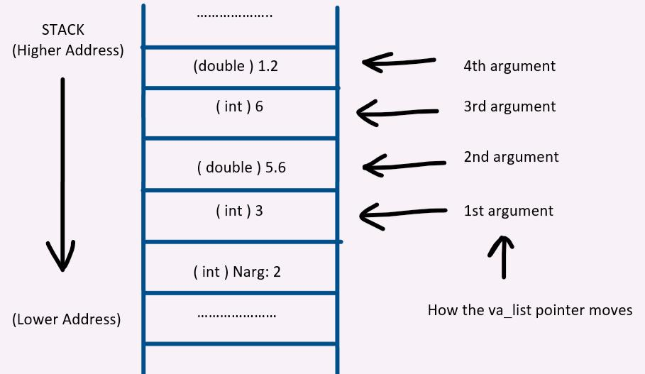

<p align="center">
  
</p>

# variadic_functions

> When you don't know how many arguments you'll get — and you're totally fine with that ✨

---

## 📝 Description

This project tackles variadic functions in C — functions that accept a variable number of arguments, just like `printf` does. Using the `va_start`, `va_arg`, and `va_end` macros from `<stdarg.h>`, I implement functions that sum integers, print numbers, print strings, and even handle mixed types from a format string. As a bonus, I venture into 64-bit assembly to print "Hello, World" using nothing but a raw system call.

---

## 🎯 Learning Objectives

At the end of this project, I am able to explain what variadic functions are and how they differ from regular C functions. I know how to correctly use the `va_start`, `va_arg`, and `va_end` macros to iterate over an unknown number of arguments at runtime. I understand why and how to use the `const` type qualifier to signal that a parameter should not be modified, improving both safety and readability. I can also reason about type promotion rules that apply when passing arguments to variadic functions.

---

## 🛠️ Technologies Used

This project is written in C, compiled with `gcc` on Ubuntu 20.04 LTS using strict flags (`-Wall -Werror -Wextra -pedantic -std=gnu89`). The `<stdarg.h>` macros (`va_start`, `va_arg`, `va_end`) are used to handle variable argument lists. Betty style is enforced. The advanced task is written in x86-64 NASM assembly, compiled with `nasm` and linked with `gcc` or `ld`.

---

## ⚙️ Requirements

- OS: Ubuntu 20.04 LTS
- Compiler: `gcc` with flags `-Wall -Werror -Wextra -pedantic -std=gnu89`
- All files must end with a new line
- Code must follow the Betty style (checked with `betty-style.pl` and `betty-doc.pl`)
- No global variables allowed
- No more than 5 functions per file
- Only `malloc`, `free`, and `exit` from the standard library (`printf`, `puts`, etc. forbidden except where stated)
- Allowed macros: `va_start`, `va_arg`, `va_end`
- `_putchar` is allowed and provided by the school
- All function prototypes (including `_putchar`) must be in `variadic_functions.h`
- All header files must be include-guarded
- A `README.md` at the root of the project is mandatory

---

## 🚀 Installation

```bash
git clone https://github.com/GwenP88/holbertonschool-low_level_programming.git
cd holbertonschool-low_level_programming/variadic_functions
```

---

## ▶️ Usage / Execution

Compile each task with its corresponding files:

```bash
gcc -Wall -pedantic -Werror -Wextra -std=gnu89 0-main.c 0-sum_them_all.c -o a && ./a
gcc -Wall -pedantic -Werror -Wextra -std=gnu89 1-main.c 1-print_numbers.c -o b && ./b
gcc -Wall -pedantic -Werror -Wextra -std=gnu89 2-main.c 2-print_strings.c -o c && ./c
gcc -Wall -pedantic -Werror -Wextra -std=gnu89 3-main.c 3-print_all.c -o d && ./d
nasm -f elf64 100-hello_world.asm && gcc -no-pie -std=gnu89 100-hello_world.o -o hello && ./hello
```

---

## 📊 Project Progress

<p align="center">

</p>

<p align="center">
<sub>Mandatory tasks completion: 100% --- Advanced tasks completion: 100%</sub>
</p>

---

## ✨ Features

### Task 0 - Beauty is variable, ugliness is constant

- Mandatory
- Write a function that returns the sum of all its parameters
- Prototype: `int sum_them_all(const unsigned int n, ...);`
- If `n == 0`, return `0`; otherwise sum all `n` following integer arguments

**Files:** `0-sum_them_all.c`

---

### Task 1 - To be is to be the value of a variable

- Mandatory
- Write a function that prints integers separated by a custom separator, followed by a newline
- Prototype: `void print_numbers(const char *separator, const unsigned int n, ...);`
- If `separator` is NULL, it is not printed between numbers

**Files:** `1-print_numbers.c`

---

### Task 2 - One woman's constant is another woman's variable

- Mandatory
- Write a function that prints strings separated by a custom separator, followed by a newline
- Prototype: `void print_strings(const char *separator, const unsigned int n, ...);`
- If `separator` is NULL, skip it; if a string argument is NULL, print `(nil)` instead

**Files:** `2-print_strings.c`

---

### Task 3 - To be is to be the value of a variable (again, with feeling)

- Mandatory
- Write a function that prints mixed types based on a format string (`c` = char, `i` = int, `f` = float, `s` = string)
- Prototype: `void print_all(const char * const format, ...);`
- No `for`, `goto`, ternary, `else`, or `do...while`; max 2 `while` loops, 2 `if`, 9 variables; NULL strings print as `(nil)`

**Files:** `3-print_all.c`

---

### Task 4 - Real programmers can write assembly code in any language

- Advanced
- Write a 64-bit NASM assembly program that prints `Hello, World` followed by a newline
- Only the `write` system call may be used (via `int` or `syscall`, not a function call)
- Compiled with: `nasm -f elf64 100-hello_world.asm && gcc -no-pie -std=gnu89 100-hello_world.o -o hello`

**Files:** `100-hello_world.asm`

---

## 🤝 Contributions & Acknowledgements

Thanks to Holberton School for this project — nothing quite humbles you like reimplementing `printf` piece by piece. The assembly task was a special kind of fun: turns out "Hello, World" hits different when you write it in syscalls. 🖥️

---

## 👤 Author

**Gwenaelle PICHOT**
- Student at Holberton School
- Track: holbertonschool-low_level_programming
- Project: variadic_functions
